```{r setup, include=FALSE}
knitr::opts_chunk$set(echo = FALSE)
```

# 1.0 Critique of Visualisation

The original visualization is shown below as the reference.
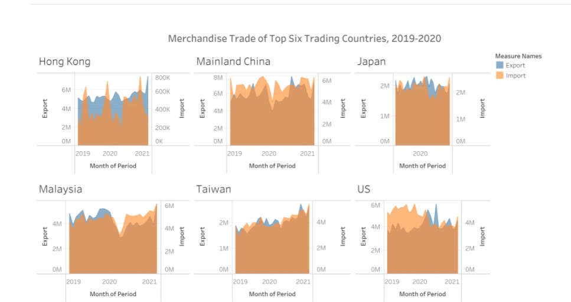

## 1.1 Clarity 

* The title of the visualization does not convey the core idea of this visualization well to the audience. It does not highlight what the trading countries are for.  

* No proper explanatory notes are shown. First of all, from the original dataset, all data points are in thousand dollars. This important piece of information is not shown anywhere on the visualization. Secondly, no source of data is shown.

* Top 6 trading countries - selection criteria is not declared. After inspection, they are top trading partners of Singapore ranked by Singapore’s import volume (excluding Indonesia).

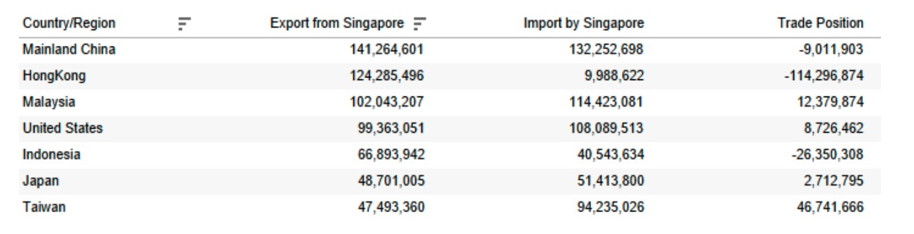

* Y-axis scales are not synchronized. Hence, it is hard to compare and interpret the relationship between export and import as the audience cannot directly tell the trade deficit/surplus for the particular month.

* Just by looking at the shaded area graph, it is hard to tell the magnitude changes of the trade deficit/surplus, which is a very important aspect of the trade trend comparison.

* X-axis does not have a uniform time frame. Except for Japan, the rest all have 2021 shown - misleading. Japan only has 2020.

## 1.2 Aesthetic 

* Poor use of colours in the chart to contrast export and import. Area chart is used with shading, which is not helpful in interpreting the relationship. Both colours have a certain level of transparency set. When import and export overlap with each other, it is confusing to look at colour.

* Annotations are not used to highlight message


# 2.0 Alternative Design

## 2.1 Clarity

* Redesign the title and subtitle to clearly convey the purpose of the visualization by mentioning this is trade data related to Singapore and explain the criteria for the countries displayed.

* Explanatory notes are added to the bottom of the visualization to show the units of the monetary values and the source of the dataset.

* Add histogram in the visualization to show the direction and magnitude of Singapore's trade deficit/surplus for each month

* Adjust the x-axis labels to ensure it is uniform across different countries and display periods only from Jan 2019 to Dec 2020

* The dual axis displays net export (left) and Import/Export (right). x-axis is synchronized across each country displayed.


## 2.2 Aesthetic 

* A contrasting colour palette (blue - export, red - import) is used for the line chart. A grey colour is used for the histogram to display the net export field. Only the light grey colour is used for histogram, this is to avoid confusing the audience with too many colours on the graph.

* Add annotations to highlight the huge change in percentage and aid in understanding 

* To better fit a desktop screen display, have separated into two panels to display the 6 countries


# 3.0 Proposed Visualisation

Please view the visualisation makeover on Tableau Public [here]().


# 4.0 Step-by-step Guide

## 4.1 Data Preprocessing

-------------------------------------------------------------------------------------------
1. Delete info rows from the excel sheet.  


{width=70%}


-------------------------------------------------------------------------------------------
2. Import  the data into tableau.  

-------------------------------------------------------------------------------------------
3. Pivot all columns with export/import values in the particular month for both datasets, rename the fields correctly, split the country name by the left bracket and correct the datatype of the fields.

{width=250px}
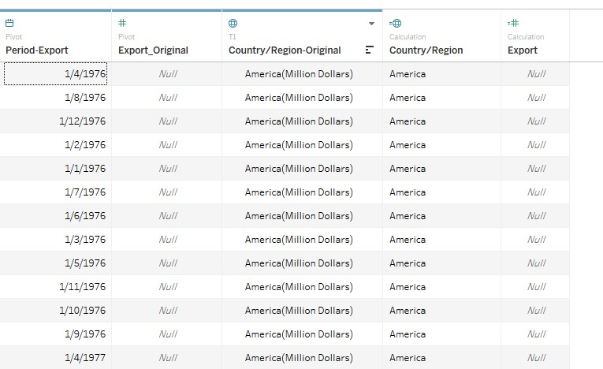{width=350px}
-------------------------------------------------------------------------------------------
4. Join the two datasets by the respective fields (country and period).

{width=450px}
-------------------------------------------------------------------------------------------
5. Create a calculated field ‘Net Export’ (Import - Export) to record Singapore’s trade deficit/surplus with the level of details.

{width=450px}
-------------------------------------------------------------------------------------------

## 4.2 Dashboard Building


-------------------------------------------------------------------------------------------
6. Create a new sheet and drag the respective fields into the build area. Measure Values include Sum(Export) and Sum(Import).

{width=250px}
{width=250px}

-------------------------------------------------------------------------------------------
7. Add filters to select country.

{width=350px;height=350px}
-------------------------------------------------------------------------------------------
8. Add filters to select year of the period.

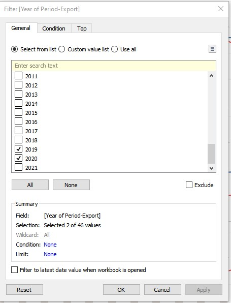{width=350px;height=350px}
-------------------------------------------------------------------------------------------
9. Change the Net Export Mark Type to bar and edit colour to light gray and reduce opacity.

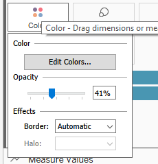{width=250px}
-------------------------------------------------------------------------------------------
10. Right click on Measure Values to check on dual axis.

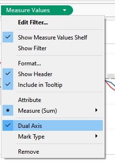{width=250px}
-------------------------------------------------------------------------------------------
11. Fix the y-axis range by right clicking on ‘Edit Axis…’ ; Rename the y-axis properly.

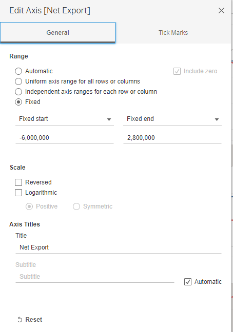{width=250px}
-------------------------------------------------------------------------------------------
12. Add a constant reference line on y-axis to highlight the boundary for trade deficit/surplus to aid visual interpretation.


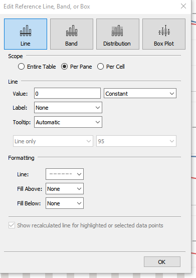{width=250px}
-------------------------------------------------------------------------------------------
13. Create a calculated field to compute the percentage difference from the previous period for both export and import.


{width=450px}
-------------------------------------------------------------------------------------------
14. Add annotations to the specific datapoint to highlight the changes.

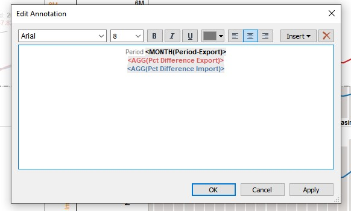{width=450px}
-------------------------------------------------------------------------------------------
15. The visualization sheet is ready.

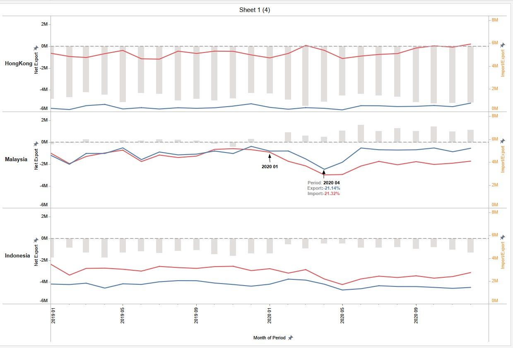{width=70%}
-------------------------------------------------------------------------------------------
16. For better visualization purposes, split into two panels and use dashboard to display the graph.

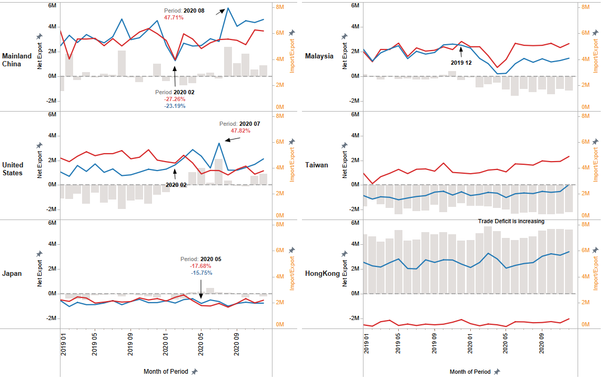{width=70%}
-------------------------------------------------------------------------------------------
17. Rename the aliases for the measure names to show information from Singapore’s perspective, easier for readers to understand.

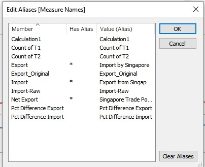{width=250px}

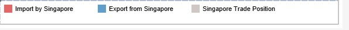
-------------------------------------------------------------------------------------------
18. Add notes at the bottom of the dashboard.

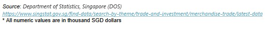
-------------------------------------------------------------------------------------------
19. Create a proper header for the visualization.

{width=250px} 

-------------------------------------------------------------------------------------------

# 5.0 Derived Insights


## 5.1 Largest Trade Surpluses and Deficits

* Among Singapore’s top trading partners by Export values from Singapore. We can tell that except for the US, the rest are all Asian countries.

* Singapore has been consistently at the trade deficit position with Taiwan in the year 2019 and 2020 with import values greater than the export values. By observing the histogram, it seems that the trade deficit was slowly climbing up in the year 2020. Taiwan is also ranked as the top pattern with Singapore incurred the highest trade surpluses in 2020.

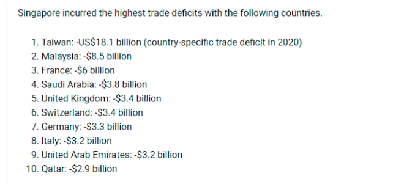{width=250px} 

* In contrast, Singapore has been consistently at the trade surplus position with Hong Kong in the year 2019 and 2020 with import values lower than the export values. Among all the trade partners, Hong Kong contributed the most of the trade surplus in Singapore 2020 trade balances.

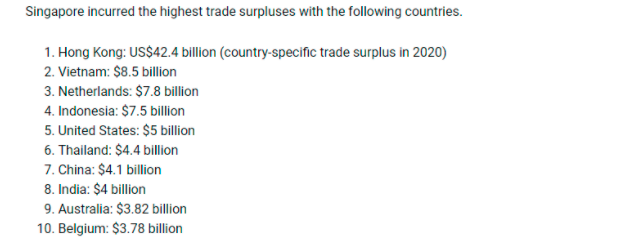{width=250px} 

[Source](https://www.worldstopexports.com/singapores-top-import-partners/)


## 5.2 Mainland China 

* Mainland China is Singapore’s top trading partner by Singapore’s export dollar values. Both import and export fluctuate largely in values with months like Feb 2019, Sep 2019, Jan 2021 and August 2020 onwards. Singapore’s export to China largely increased in Aug 2020 with a 47.71% percentage of change from the previous month. Despite the global pandemic that caused economic recessions in the early of 2020 with a sharp decrease with both export and import, the recovery in the second half of the year was strong. This shows great complementarity and stability of Singapore-China bilateral trade.

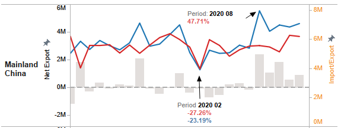{width=70%} 

## 5.3 Malaysia

*In 2019, Singapore and Malaysia were at a close breakeven position of trade. However, in 2020, Singapore entered into a trade deficit situation with Malaysia and the gap has been widening since then.


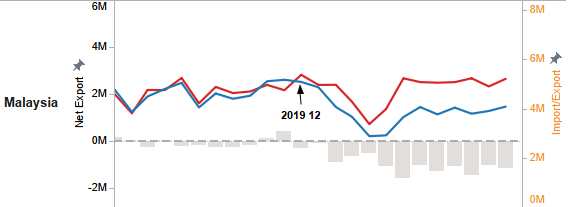{width=70%} 
