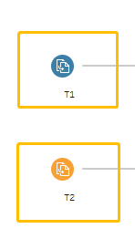
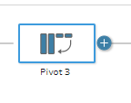
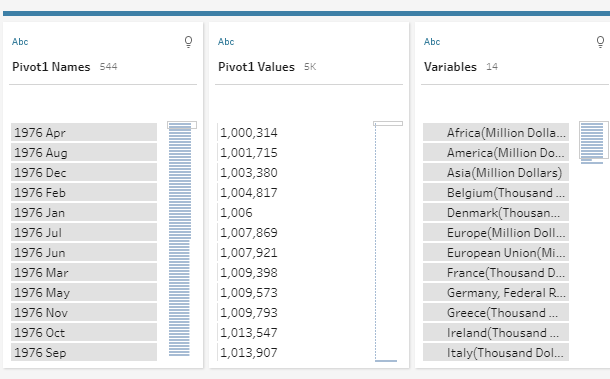

```{r setup, include=FALSE}
knitr::opts_chunk$set(echo = FALSE)
```

# 1.0 Critique of Visualisation

The original visualization is shown below as the reference.

[Link from the source website](https://www.singstat.gov.sg/modules/infographics/singapore-international-trade)

* It is observed that the visualization is trying to show the top trade partners with total merchandise trade values (export + import) and also show the trade balance with Singapore. 

* The chart also identifies the top country with the most traded export/import by addng an icon besides it.

* The blue box with words seems to show an over years changes for China and USA 

## 1.1 Clarity 

To better convey the message to the audience, the visualization should be clear and direct for interpretations. 

* First of all, the original design only display 2020's trade relationship with Singapore's major trade partners. However, the below description highlights time period not included in the visualization which causes confusion on the intent of the visualization. 


* The visualization itself is confusing as most of the information cannot be directly interpreted from the chart. Viewers need to go through the explanatory notes below the chart to have an understanding of the graph itself.


## 1.2 Aesthetics

* The color of the bubble merely identify the countries but does not add values to the visualization.

* The size of the bubble is excessively big with regards to the size of the chart itself. Some of the bubbles are covered by other bubbles. Even though viewers could be able to highlight bubbles when hovering over the particular bubble, this action seems not add much meanings to the visualization.

* The advantage of bubble chart is that it is able to allow visualizations of more dimensions. However, this particular design does not make full use of the bubble chart as viewers could only interpret different countries' export, import and total trade with Singapore.

* The axis element is not well labeled with units. The gif icons try to explain the perspective of the export/import, however, they are very small. 


# 2.0 Alternative Design


# 3.0 Proposed Visualisation

Please view the visualization makeover on Tableau Public [here](https://public.tableau.com/app/profile/cryshelle.yang.xu/viz/DataViz_Dashboard_publish/Dashboard1).


# 4.0 Step-by-step Guide

## 4.1 Data Clearning and Preprocessing 

-------------------------------------------------------------------------------------------
1. Import 
The dataset is in xlsx format with two tabs for import and export respectively. Use Tableau Prep builder to import the datasets and drag T1 and T2 on the pane.


-------------------------------------------------------------------------------------------
2. Pivot

Add a step of pivot to the flow pane.

Select all date columns and pivot the data into a long format.

-------------------------------------------------------------------------------------------
3. Join

-------------------------------------------------------------------------------------------
4. Cleaning
-------------------------------------------------------------------------------------------
5. Output to Tableau Desktop 
-------------------------------------------------------------------------------------------

## 4.2 Create Calculated Fields 

-------------------------------------------------------------------------------------------
1. 
-------------------------------------------------------------------------------------------
-------------------------------------------------------------------------------------------
-------------------------------------------------------------------------------------------
-------------------------------------------------------------------------------------------
-------------------------------------------------------------------------------------------
-------------------------------------------------------------------------------------------
-------------------------------------------------------------------------------------------
-------------------------------------------------------------------------------------------
-------------------------------------------------------------------------------------------
# 5.0 Derived Insights
