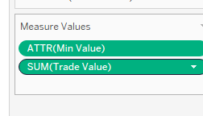

```{r setup, include=FALSE}
knitr::opts_chunk$set(echo = FALSE)
```

# 1.0 Critique of Visualisation

The original visualization is shown below as the reference.

[Link from the source website](https://www.singstat.gov.sg/modules/infographics/singapore-international-trade)

* It is observed that the visualization is trying to show the top trade partners with total merchandise trade values (export + import) and also show the trade balance with Singapore. 

* The chart also identifies the top country with the most traded export/import by addng an icon besides it.

* The blue box with words seems to show an over years changes for China and USA 

## 1.1 Clarity 

To better convey the message to the audience, the visualization should be clear and direct for interpretations. 

* First of all, the original design only display 2020's trade relationship with Singapore's major trade partners. However, the below description highlights time period not included in the visualization which causes confusion on the intent of the visualization. 


* The visualization itself is confusing as most of the information cannot be directly interpreted from the chart. Viewers need to go through the explanatory notes below the chart to have an understanding of the graph itself.


* Title does not convey clearly the main message of the visualization.

* Even the shading is used to show the trade balance, however, it is hard to interpret especially with the perspective not clearly defined. 

## 1.2 Aesthetics

* The color of the bubble merely identify the countries but does not add values to the visualization.

* The size of the bubble is excessively big with regards to the size of the chart itself. Some of the bubbles are covered by other bubbles. Even though viewers could be able to highlight bubbles when hovering over the particular bubble, this action seems not add much meanings to the visualization.

* The advantage of bubble chart is that it is able to allow visualizations of more dimensions. However, this particular design does not make full use of the bubble chart as viewers could only interpret different countries' export, import and total trade with Singapore.

* The axis element is not well labeled with units. The gif icons try to explain the perspective of the export/import, however, they are very small. 


# 2.0 Alternative Design
With the below proposed design, the aforementioned points are to be addressed.


* Gradient of colour will be used to display the relative trade position of each partner. 

* Size of the bubble is made smaller to ensure viewers can observe each partner clearly.

* Tooltip is added to show details of the trade relationship and breakdown of months to reveal trend (consistently deficit/surplus or change frequently)

* Histogram to show the exact values of the export/import.

* A word board is shown at the side for viewers to quickly grab the trade positionn at one glance.


# 3.0 Proposed Visualisation

Please view the visualization makeover on Tableau Public [here](https://public.tableau.com/app/profile/cryshelle.yang.xu/viz/DataViz2_16242029410430/Dashboard1).


# 4.0 Step-by-step Guide

## 4.1 Data Clearning and Preprocessing 

-------------------------------------------------------------------------------------------
1. Import 
The dataset is in xlsx format with two tabs for import and export respectively. Use Tableau Prep builder to import the datasets and drag T1 and T2 on the pane.


-------------------------------------------------------------------------------------------
2. Pivot

Add a step of pivot to the flow pane.

Select all date columns and pivot the data into a long format.

-------------------------------------------------------------------------------------------
3. Join

Add a join step and join T1 and T2 based on the shownw criteria. Make sure data is correctly matched.


-------------------------------------------------------------------------------------------
4. Cleaning

Perform various data cleaning steps. 
  + Remove repeated columns 
  + Custom split the Country/Region into purely Country/Region and Unit 
  
  
  
  + Rename columns and change to proper role 
  
  
-------------------------------------------------------------------------------------------
5. Output to Tableau Desktop 

Add a output step and choose the location and output type. 
Drag the output file into Tableau Desktop.
-------------------------------------------------------------------------------------------

## 4.2 Develop Bubble Chart 

-------------------------------------------------------------------------------------------
1. Create Net Export to calculate the trade balance.

  
-------------------------------------------------------------------------------------------
2. Create measures: Export to Singapore and Import from Singapore to split the trade value to two categories. Drag the two measures to row and column 


-------------------------------------------------------------------------------------------
3. Drag country/region to the details ; drag trade value to size ; drag net export to colour


-------------------------------------------------------------------------------------------
4. Create measures for tooltip:
  + Rank Measures to show the relative position of export/import 
  

-------------------------------------------------------------------------------------------
5. Create Tooltip graph using the shading area between export and import 

   * Create calculated field Min Value 
  
  
  * Drag the dimensions to the rows and columns and use dual axis to draw the area graph
  
    
   
 
 
 
* Edit the colour of the category to change the Min Value to white colour 

  
  * Insert Trade Value as a trend line by dragging the trade value to the graph, use dual axis
  and use colour to differentiate export and import 
  
  

-------------------------------------------------------------------------------------------
6. Create Tooltip page 

Use all the measures built above to realize the tooltip page which will display the breakdown of month trade balance 


-------------------------------------------------------------------------------------------
7.Trade Position 

Create a neW worksheet to display trade position 
Drag country/region to rows and add net export to colour 

-------------------------------------------------------------------------------------------

8. Motion and Sync Filters across different pages 

Enable animations from Format -> Animations. 
Sync country/region and month-year filters across different pages


-------------------------------------------------------------------------------------------
9. Dashboard

Combine different pages to the same dashboard. 
Use the motion control on the top, the dashboard will show the changes of various perspectives.
-------------------------------------------------------------------------------------------

# 5.0 Derived Insights


1. By using the animation, we can observe the trend of Singapore's major trade partners during 2020-2020. During the past 20 years, we can see the total trade value increases year by year. 

2. In the early 2020s, Singapore has huge annual trade deficit with Japan. The trade deficit decreases over the year, and almost reached to a trade breakeven in 2020. This suggests Singapore's trade advantage with Japan has improved. 

3. Singapore has always has trade surplus with Hong kong. Hong Kong has ranked as top during the past 20 years with value of imported goods from Singapore, however, Singapore imported less from Hong Kong among the major trade partners.
